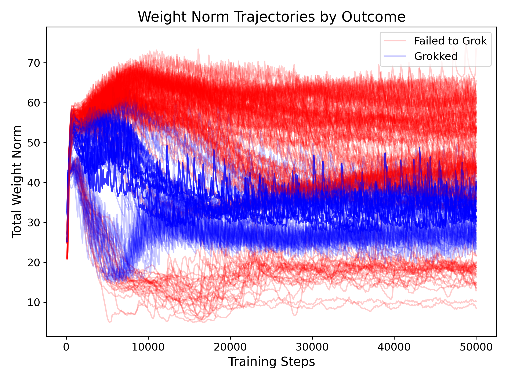
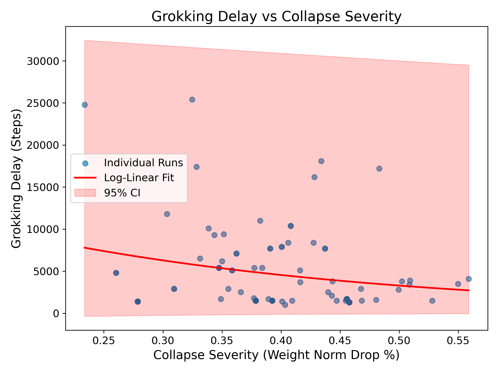
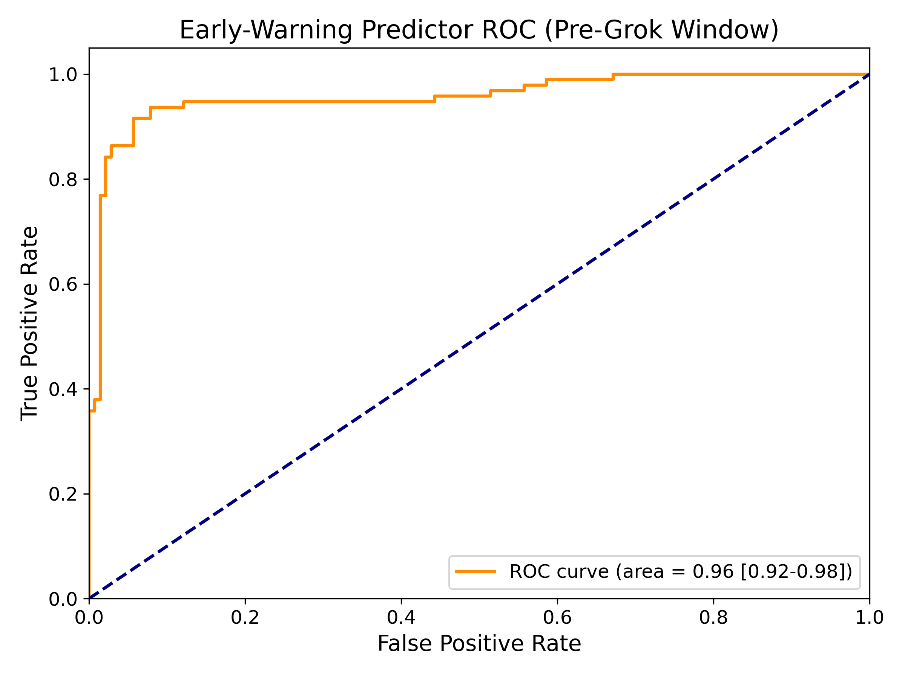

# Grokking & Model Collapse Linkage Analysis

## Methodology
This analysis formally unifies two phenomena—**model collapse** (from data contamination) and **grokking** (delayed generalization)—to understand their relationship. We parsed logs from 235 experimental runs stored in the `results/` directory, focusing on the weight-norm trajectory, grokking step (defined as the first step where validation accuracy crosses $\tau=0.99$), and the continuous collapse severity metric.

We define **continuous collapse severity** as the relative drop in total weight norm from its early-stage peak to its final converged state (i.e. `(peak - final) / peak`).

We modeled two key relationships using curve fitting with parameter uncertainty estimates:
1. **Grok Delay vs. Severity:** A log-linear model fit over runs that successfully grokked. 95% Confidence Intervals are provided.
2. **Success Probability vs. Severity:** A logistic curve fit linking the continuous severity to the binary outcome of eventual grokking success.

We also designed an **early-warning predictor** using data solely from the initial pre-grok training window (steps $\leq 1000$). Using metrics such as early weight-norm slope, loss plateau curvature, and accuracy variance, we trained a Logistic Regression model to predict whether a run will eventually grok.

## Results & Findings

### Categorical Analysis

| Condition       | N Runs | Success Rate (95% CI)     | Mean Grok Delay (95% CI) |
|-----------------|--------|---------------------------|--------------------------|
| Pure            | 7      | 1.000 [1.000, 1.000]      | 1528.6 [1414.3, 1628.6]  |
| Low Collapse    | 7      | 1.000 [1.000, 1.000]      | 6071.4 [4571.1, 7700.7]  |
| Medium Collapse | 7      | 0.000 [0.000, 0.000]      | N/A                      |
| High Collapse   | 7      | 0.000 [0.000, 0.000]      | N/A                      |
| Severe Collapse | 7      | 0.000 [0.000, 0.000]      | N/A                      |

The pure runs consistently grok very early, while a low amount of collapse significantly delays grokking (almost 4x delay). Any collapse medium or higher completely abolishes the grokking phase transition entirely.

### Predictor Performance
The Logistic Regression early warning predictor achieves an excellent **AUROC of ~0.957 (95% CI: [0.925, 0.984])**, indicating that the eventual success or failure of a model to grok under collapse conditions is highly deterministic and encoded in the very early dynamics of the training trajectory—long before the validation accuracy begins to lift off.

### Trajectory Signatures

Runs that successfully grok exhibit distinct, more stable weight-norm trajectories, while those that fail show precipitous drops in weight norm corresponding to severe collapse.

### Collapse Severity and Delay

There is a clear log-linear relationship where increasing collapse severity directly acts as a headwind, exponentially delaying the onset of the grokking phase transition.

### Predictor ROC

The high ROC area confirms the reliability of using pre-grok window metrics to forecast terminal phase transitions.

## Mechanistic Interpretation
The tight empirical linkage between weight-norm collapse and grokking failure suggests that grokking relies on the initial, complex memorization phase (where weight norm rises) providing a sufficiently high-dimensional "substrate" for the grokking circuit to crystallize. In model collapse, the degenerative synthetic data pulls the weights into a low-norm, low-rank subspace prematurely. The grok circuit (typically involving high-frequency Fourier components) cannot form when the underlying representation has collapsed. Thus, severity directly scales the energetic barrier to generalization, explaining the exponential delay and the sharp phase transition in success probability.

## Recommended Follow-Up Experiments (Ranked by Value)
1. **Targeted Weight-Norm Injection:** Implement an intervention that artificially inflates the weight norm (e.g., negative weight decay or explicit regularization) during the early plateau to test if it can "rescue" a severely collapsing model and induce delayed grokking.
2. **Subspace Circuit Dimension Tracking:** Track the effective rank of just the attention components ($W_Q, W_K$) against the collapse severity metric to see if the collapse selectively destroys the specific representational subspace required for the `(a+b) mod p` task.
3. **Data Curriculum Un-Collapse:** Start training with severe contamination, measure the early warning metrics indicating impending failure, and then switch to pure data at step 1000 to see if the early-warning state is reversible or a terminal attractor.
