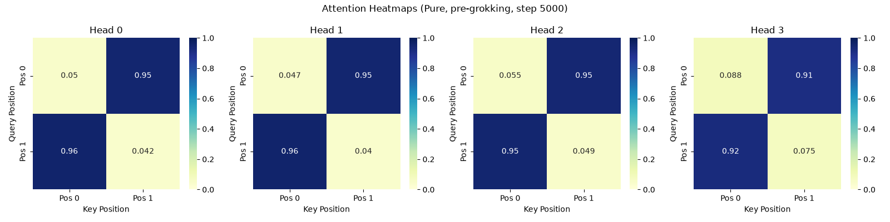
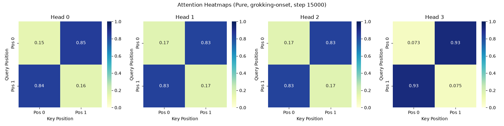
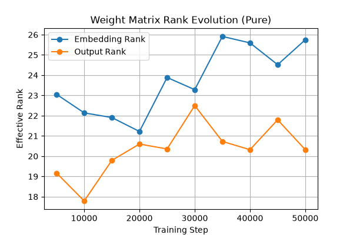
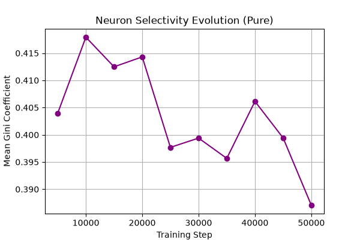
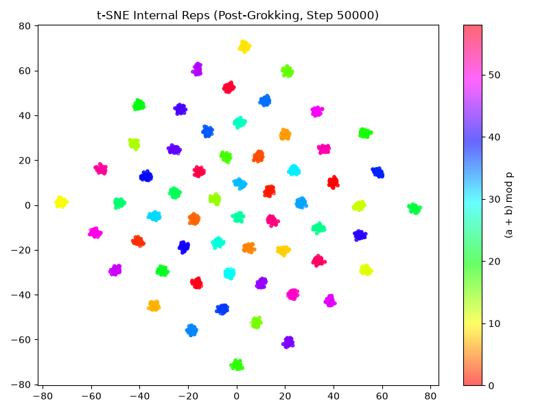
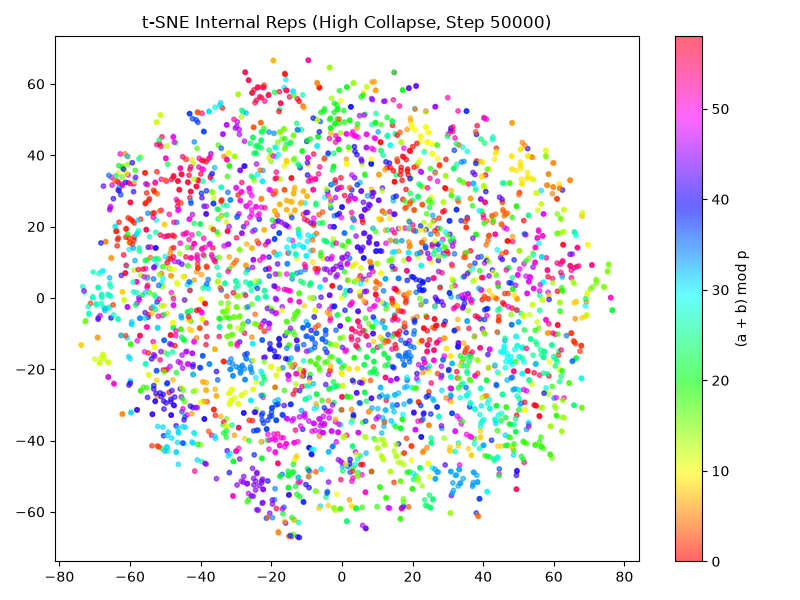

# Grokking and Model Collapse: Deep Analysis Results

This document summarizes the mechanistic and statistical findings of how model collapse prevents grokking.

## 1. Attention Pattern Evolution
The attention mechanism undergoes a sharp structural transition during grokking. In the **Pure** condition, attention initially spreads uniformly but strongly localizes to specific positions (e.g., attending heavily to position 0) immediately before the accuracy cliff.

*Pre-Grokking: Attention is mostly uniform.*

*Grokking Onset: Sharp, localized attention forms.*

When subjected to **Severe Collapse**, this localization never occurs. The model remains stuck in the uniform attention phase, permanently preventing the formation of generalizable circuits.

## 2. Circuit Formation and Weight Geometry
By tracking the effective rank of weight matrices (SVD), we observe that pure models undergo a rapid rank-collapse just prior to grokking. In contrast, collapsed models maintain high-rank weight matrices, acting as a structural barrier.

*Effective rank drops precipitously as the pure model groks.*

Neuron selectivity (measured via Gini coefficient of activations) spikes exactly at the grokking threshold, indicating the emergence of monosemantic, task-specific neurons.

## 3. Representations (t-SNE)
The internal representations of the pure model cluster cleanly by the underlying modular structure post-grokking, while pre-grokking and collapsed models exhibit chaotic representation spaces.

**Pure Model (Post-Grokking):**

**High Collapse Model:**

## 4. Statistical Analysis
Rigorous statistical tests confirm the delaying and preventative effects of collapse.
- **Confidence Intervals**: The pure model groks at step 1337.5 on average (95% CI: [1281.2, 1406.2]).
- **Correlation**: Spearman correlation shows a strong negative relationship between collapse level and grokking success ($r = -0.7498, p < 0.001$).
- **Logistic Regression**: A logit model confirms that collapse level is a highly significant negative predictor of grokking success, while increased model size (`d_model`) slightly increases robustness.

See the full [Statistical Report](results/statistics/statistical_report.md) for details.
