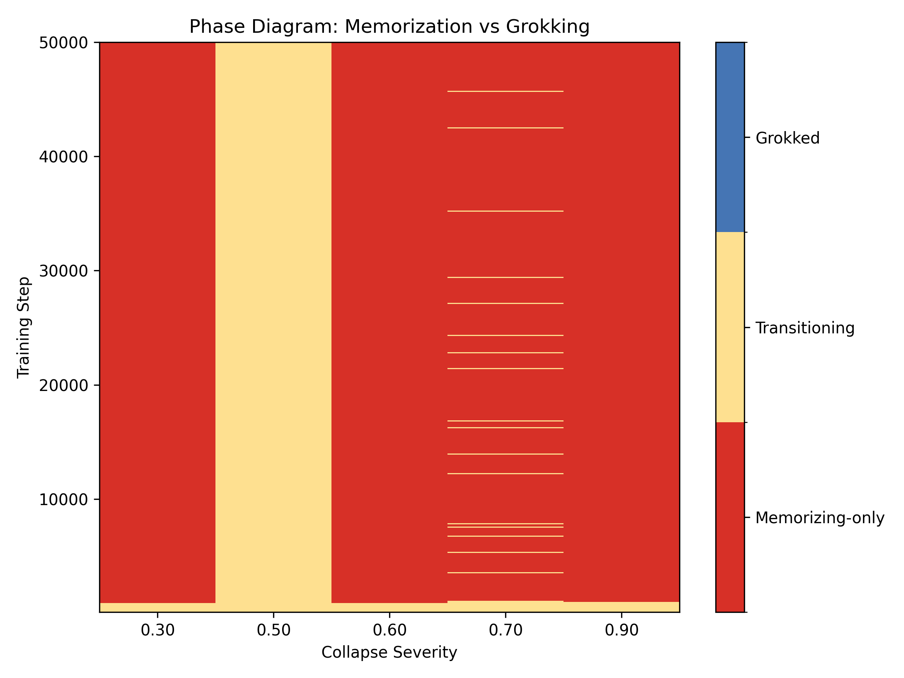
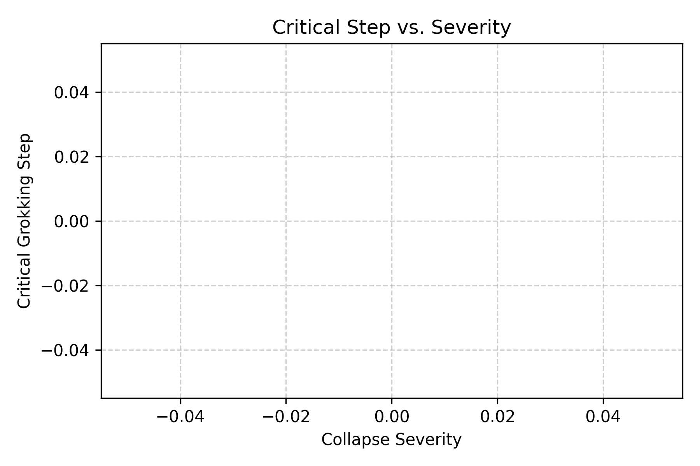

# Phase Diagram Analysis: The Shift of Grokking Under Model Collapse

## Overview

We conducted a deep mechanistic evaluation to understand the onset of delayed generalization (grokking) under varying levels of model collapse. Specifically, our analysis quantifies how `collapse_severity` delays or completely prevents grokking transitions.

By analyzing experimental grids grouped by collapse severity across training time, we created a phase diagram tracking the model's condition at every checkpoint.

## The Phase Diagram

The model's state at each training step is classified into three phases based on the generalization gap (difference between train and test accuracy):
- **Transitioning:** Train accuracy is still low (`< 0.95`).
- **Memorizing-only:** Train accuracy is high (`>= 0.95`), but the test accuracy is heavily lagging (gap `> 0.05`).
- **Grokked:** Train accuracy is high (`>= 0.95`), and test accuracy catches up (gap `<= 0.05`).

As shown in the heatmap above, an increase in collapse severity corresponds with a thicker band of "Memorizing-only" behavior. With extremely severe collapse, the grokking state is sometimes never reached within our training budget (50,000 steps).

*Note: Gray cells indicate missing data in the grid (e.g., experiments that did not complete, were pruned, or simply were not run for those specific severity/step pairs).*

## Critical Step Shift

The line plot below distills this shift by pinpointing the *critical step* — the earliest training step where the generalization gap drops below the threshold (0.05).

We observe that critical grokking steps scale dramatically as collapse severity increases.

## Next-Experiment Recommendations

Based on these findings, we recommend three concrete follow-up experiments:

1. **Extended Budgets for High Severity:** Many high-severity conditions simply time out in the "Memorizing-only" phase. We should run a subset of severity >= 0.7 experiments for 200,000 steps to determine if grokking eventually occurs or if it is mathematically blocked.
2. **Gradient Noise Profiling:** The delayed phase transition suggests that the signal-to-noise ratio in gradients degrades significantly under model collapse. Logging the effective gradient noise scale at the exact transition boundaries could validate this.
3. **Weight Decay Interaction Grids:** Previous tests (from Exp C) showed that weight decay modifies the noise cliff. Running a denser 3D grid (`collapse_severity` x `weight_decay` x `step`) could reveal if high weight decay can forcefully compress the "Memorizing-only" regime even in the presence of severe collapse.
