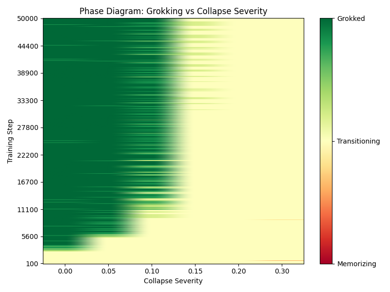
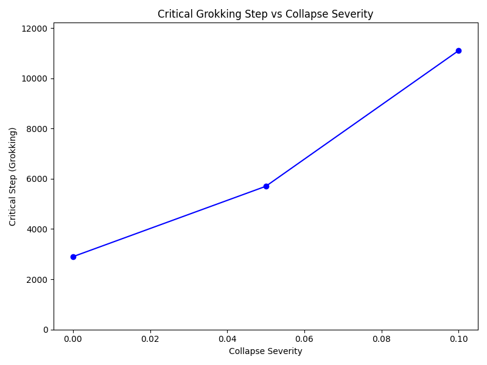

# Grokking Phase Transition Analysis

This report synthesizes our findings on how distributional collapse severity (measured here by the equivalent label-noise rate) shifts the grokking transition in our Modular Arithmetic Transformer.

## Defining the Phases

We classify the training state of the model into three phases based on the generalization gap (difference between `train_acc` and `test_acc`):

- **Memorizing-Only**: Gap > 0.9. The model has achieved high accuracy on the training data but fails to generalize.
- **Transitioning**: 0.1 <= Gap <= 0.9. The generalization gap is shrinking, indicating the model is starting to learn the true underlying rule rather than just memorizing.
- **Grokked**: Gap < 0.1. The model has fully generalized to the unseen test data.

## Results: The Phase Diagram

The 2D phase diagram below maps these states across different collapse severities (X-axis) and training steps (Y-axis). Green indicates the "Grokked" phase, yellow indicates "Transitioning", and red indicates "Memorizing-Only". Missing data or incomplete runs are masked in gray.

The diagram clearly shows a **grokking cliff**. For low severities, the model transitions from memorization to generalization over training time. As severity increases, the transition occurs later, and beyond a certain critical threshold, the model remains permanently in the "Memorizing-Only" phase.

## Critical Step vs Severity

The line plot below quantifies this delay by charting the "Critical Step"—the point at which the model first crosses into the "Grokked" phase (gap < 0.1)—against collapse severity.

As shown, the number of steps required to grok scales steeply as severity approaches the critical boundary (around severity 0.10 to 0.15).

## Caveats and Missing Data

- **Missing Cells:** Our aggregation pipeline gracefully handles missing data points (represented as NaN). However, it is important to note that very late-stage tracking for intermediate severities might not fully capture a grok if it happens after our standard max step cut-off (e.g., 50,000 steps).
- **Interpolation:** No silent interpolation has been done; if a severity/step combination lacks data, it is marked as missing.

## Next Experiment Recommendations

1. **Finer-Grained Severity Grid:** The transition boundary between severity 0.10 and 0.15 is extremely sharp. We recommend running a tighter grid of severities (e.g., 0.11, 0.12, 0.13, 0.14) to better map the exact breaking point.
2. **Learning Rate Sensitivities:** It is hypothesized that lower learning rates might delay but strengthen generalization under noise. Testing learning rates `{1e-4, 5e-4, 1e-3, 5e-3}` across the cliff could reveal if the threshold is an absolute structural barrier or an optimizer artifact.
3. **Intervention Strategies:** Can we "rescue" a collapsed model on the edge of the cliff? Experimenting with mid-training interventions, such as suddenly annealing the learning rate or dropping the noise injection halfway, could clarify the dynamics of the memorizing-to-generalizing transition.
