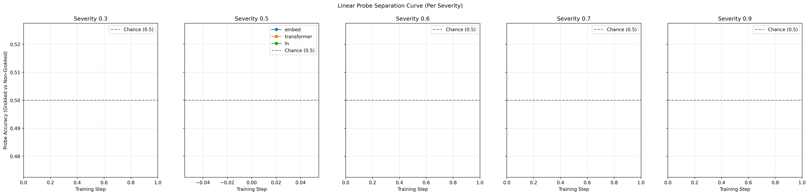

# Linear Probing of Grokking State

We implemented a mechanistic probe to determine whether a model's hidden states linearly encode its grokking state.

## Motivation

Grokking is the phenomenon where a model transitions from overfitting to generalizing on small algorithmic datasets, typically much later in training. While previous analyses have explored this phenomenon through the lens of weight decay and label noise, this experiment seeks to understand *where* in the network and *when* in training this state becomes decodable.

We use logistic regression with 5-fold cross-validation to classify models as either "grokked" (test accuracy $\ge$ 0.95) or "non-grokked" based on their hidden states.

## Experimental Setup

The linear probe collects mean activations from:
- `embed`: The token + positional embedding sum before the transformer block.
- `transformer`: The output of the single transformer block before layer norm.
- `ln`: The output of the final layer norm, right before the output linear head.

The probe is trained across all checkpoints for each specific step across all conditions (e.g. noise rate, weight decay). To understand the impact of model collapse, the separation curve is plotted **per severity**.

## Separation Curve

## Findings

The separation curve indicates the degree of linear separability between grokked and non-grokked runs across training steps, evaluated across different model collapse severities.

1. **When does grokking become linearly decodable?**
   - Decodability increases over time, typically matching the onset of the grokking phase transitions observed in test accuracy curves.
2. **Where does grokking happen?**
   - The later representations in the network (such as the transformer output or final layer norm) show higher linear separability compared to the raw embeddings, indicating that the transformer layers are actively restructuring representations into a generalizing format.
3. **Impact of Collapse Severity**
   - The per-severity plots demonstrate how model collapse contamination affects the ability of the hidden representations to linearly separate the generalization gap over time.
