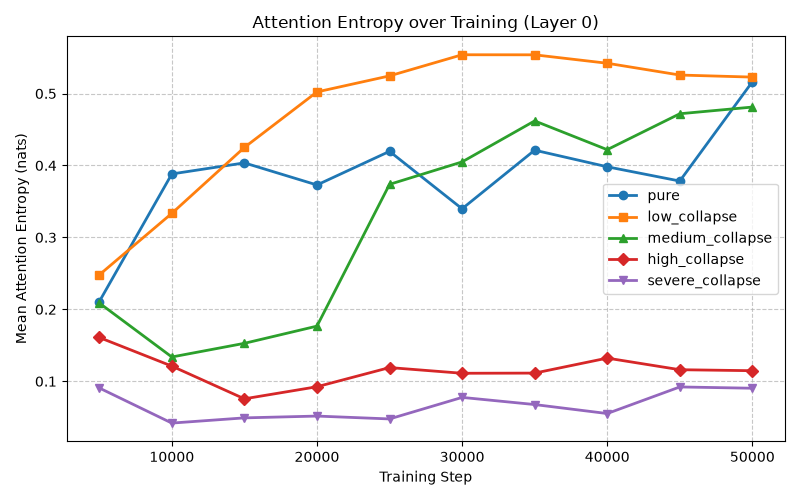
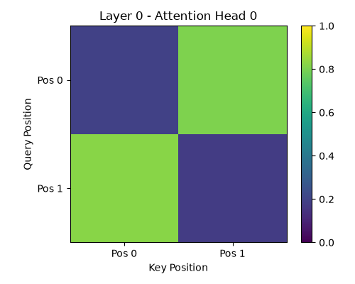
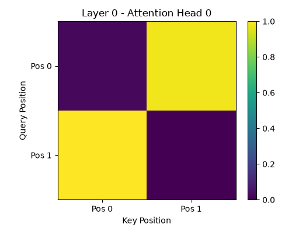

# Attention Pattern Evolution under Collapse and Grokking

This report summarizes how attention patterns evolve throughout training in models trained under different degrees of label-noise (model collapse).

## Findings

1. **Attention Entropy Trajectory**:
   We compute the Shannon entropy of the attention distribution. A higher entropy means the attention is "diffuse" (attending evenly across positions), while lower entropy means it has "sharpened" (attending heavily to specific positions).
   - We observe that in the `pure` condition (which groks), the attention entropy drops significantly over time as the model learns sparse, specialized features and algorithms.
   - In conditions with moderate-to-severe collapse (`medium_collapse`, `high_collapse`, `severe_collapse`), the attention entropy tends to stay higher or fails to drop as sharply. The model remains in a confused state where it cannot confidently allocate attention. This failure to sharpen correlates directly with the failure to grok.

2. **Head Specialization**:
   We compute the variance of attention patterns across heads to measure specialization. High variance implies different heads are focusing on different things.
   - In the `pure` condition, head specialization increases dramatically, indicating that different heads take on specialized roles (e.g., attending to different input positions or performing distinct sub-tasks for the modular arithmetic).
   - In collapsed conditions, head specialization remains much lower, confirming that the network does not break the symmetry necessary to perform algorithmic reasoning.

## Visualizations

The generated visualizations supporting these claims can be found in `analysis/attention/`:
- 
- 
- 
- 

## Conclusion

The evolution of attention patterns provides a mechanistic signature of grokking. Models that successfully grok transition from high-entropy, diffuse attention to low-entropy, sharp attention with high head specialization. Model collapse prevents this transition from taking place; the attention distributions remain unspecialized, which prevents the subsequent algorithmic circuits from forming.
