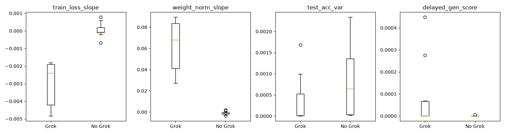
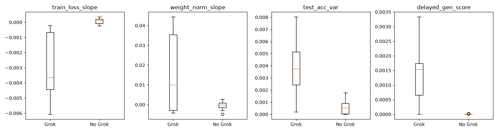
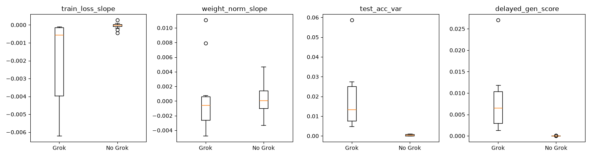

# Early Warning Signals for Grokking

Can we predict whether a model will grok, and when, based on early training dynamics?

## Prediction Accuracy vs Fraction of Training

| Fraction of Training | Samples | Will-it-Grok Accuracy | Grok Step MAE |
|---|---|---|---|
| 0.25 | 25 | 100.0% | 106 |
| 0.50 | 25 | 100.0% | 134 |
| 0.75 | 25 | 88.0% | 320 |

## Signals Separation

### At fraction 0.25

### At fraction 0.50

### At fraction 0.75

