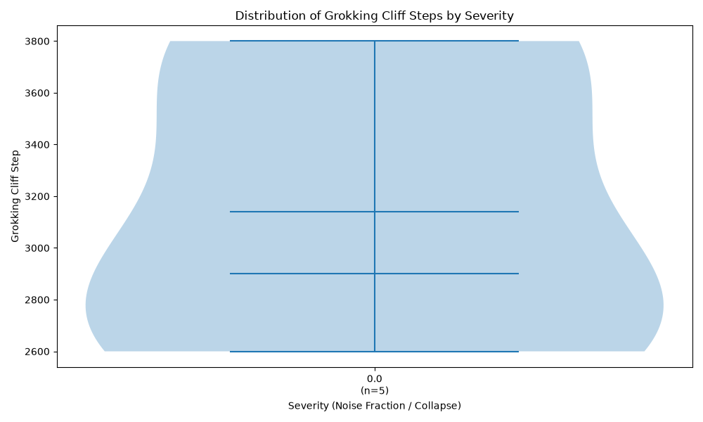
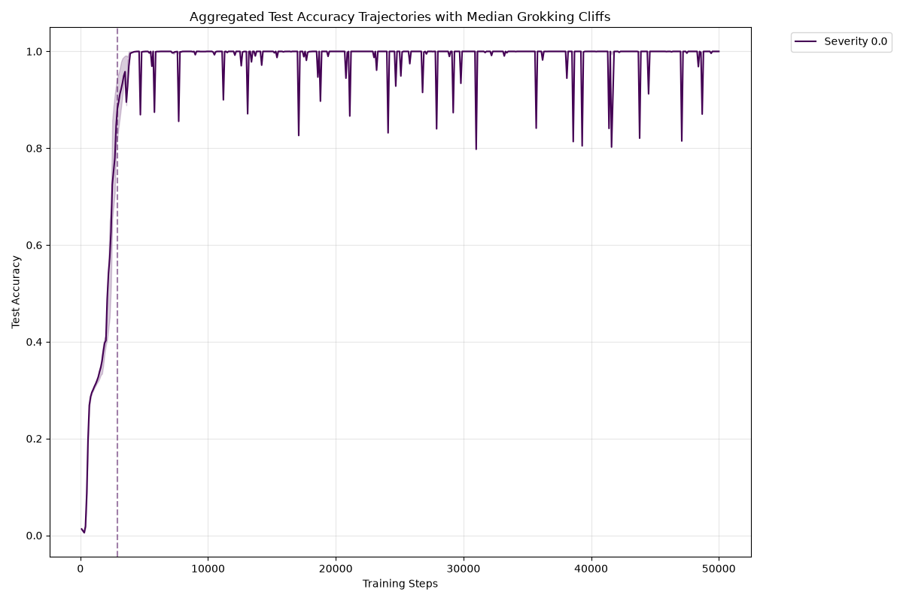

# Grokking Statistical Analysis Report

## Grokking Cliff Detection by Severity

| Severity | Runs | Grokked | Censored | Median Cliff | 95% CI Lower | 95% CI Upper |
|----------|------|---------|----------|--------------|--------------|--------------|
| 0.0 | 5 | 5 | 0 | 2900.0 | 2600.0 | 3800.0 |

## Curve Fits (Severity vs. Cliff Step)

- **Linear Fit:** $R^2 = nan$, $p = nan$
- **Logistic Fit:** $R^2 = -0.076$

## Endpoint Accuracy Comparison
**Baseline Severity:** 0.0

| Severity | Mean Final Acc | Median Final Acc | Holm-Adj p-value |
|----------|----------------|------------------|------------------|

## Visualizations

