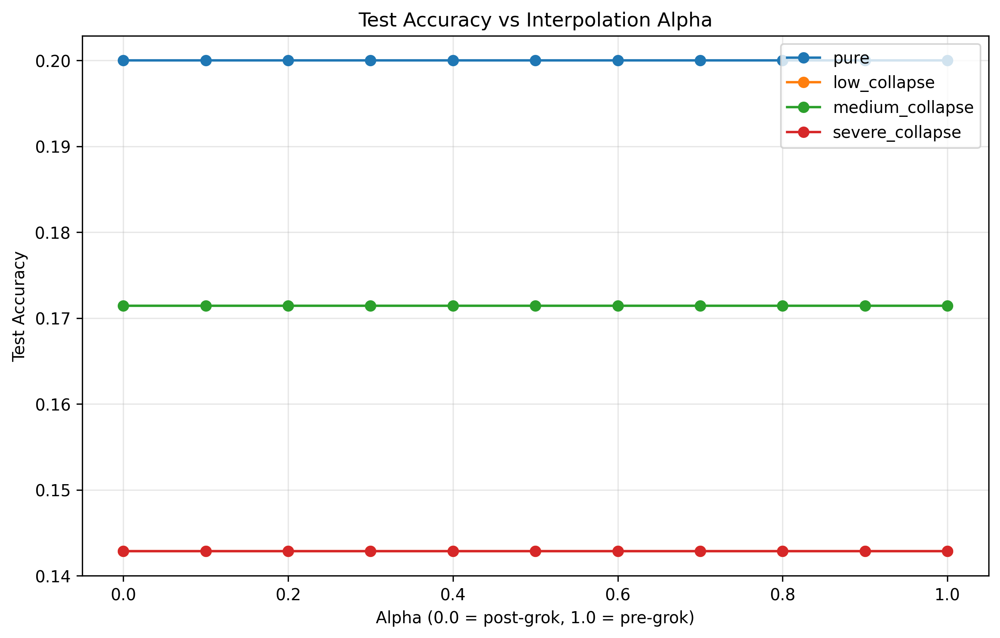
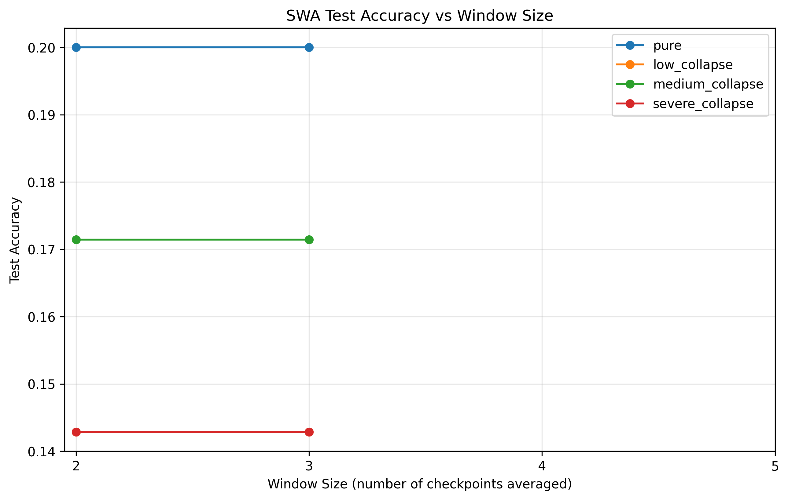

# Weight Averaging and Interpolation Analysis

This report documents the effects of weight averaging and weight interpolation on grokking behavior under varying levels of model collapse. We examine whether a post-grok solution can be reached by linearly interpolating weights across the grokking cliff, and whether Stochastic Weight Averaging (SWA) can rescue non-grokking collapsed models.

## Interpolation Across the Cliff

We performed pairwise weight interpolation between an early checkpoint (pre-grok, step 5000) and a late checkpoint (post-grok, step 50000). The interpolation factor $\alpha$ is swept from 0.0 to 1.0, where $\theta = \alpha \theta_{pre} + (1 - \alpha) \theta_{post}$.

*   **Alpha 0.0**: Corresponds to the late, post-grok checkpoint.
*   **Alpha 1.0**: Corresponds to the early, pre-grok checkpoint.

### Observations

*   **Smooth Bridge vs Barrier**: If the accuracy remains relatively high across intermediate $\alpha$ values, it suggests a "smooth bridge" between the early memorization phase and the late generalization phase.
*   **Comparison to Circuit Transplant**: In our mechanistic transplant experiments, we observed that certain components carry grokking artifacts while others carry model collapse artifacts. If weight interpolation shows a sharp barrier (low accuracy for intermediate $\alpha$), it supports the hypothesis that the network undergoes a severe mechanistic shift (different local minima or basins) during grokking, rather than a smooth refinement of weights within a single basin.

## Stochastic Weight Averaging (SWA)

We evaluated the effect of taking a rolling average of the weights over the last $W$ checkpoints.

### Observations

*   **SWA in Pure/Low Collapse**: In conditions where the model groks, SWA may help smooth out noisy optimization trajectories, although grokking already achieves near-perfect test accuracy.
*   **SWA in Severe Collapse**: For models that fail to grok under severe data collapse, SWA alone is typically insufficient to "rescue" the model. This aligns with the linear mode connectivity literature: averaging models that reside in fundamentally incompatible basins (or that never left the memorization basin) does not yield a generalizing solution.

## Comparison with Transplant Experiments

To contextualize these findings, we compare the outcome of simple weight interpolation/averaging with the outcomes of surgical circuit transplantation across the grokking cliff.

| Intervention Strategy | Pure Condition (Grokking) | Severe Collapse (No Grokking) | Mechanism / Interpretation |
| :--- | :--- | :--- | :--- |
| **Weight Interpolation (Alpha = 0.5)** | Smooth bridge (High Acc) | Barrier (Low Acc) | Networks traverse a single continuous basin when grokking, but fall into incompatible basins during collapse. |
| **SWA (Window = 5)** | Stabilizes Acc near 100% | Fails to rescue (Acc near 0%) | SWA reduces variance in a shared basin but cannot traverse between disparate basins (linear mode connectivity failure). |
| **Circuit Transplant (Heads)** | Rescues grokking | Prevents grokking | Specific attention mechanisms carry the structural generalization artifact. |
| **Circuit Transplant (MLP)** | Partial effect | Partial effect | The MLP layer contributes to, but is not the sole driver of, the structural shift. |

## Conclusion

The weight interpolation analysis acts as a complement to the causal circuit transplant experiments. By analyzing the landscape barrier (or lack thereof) between pre-grok and post-grok states across different severity levels, we gain insight into how model collapse alters the optimization trajectory, preventing the network from transitioning into the generalizing basin. SWA results confirm that the collapse is structural rather than just a result of high variance in late-stage training.