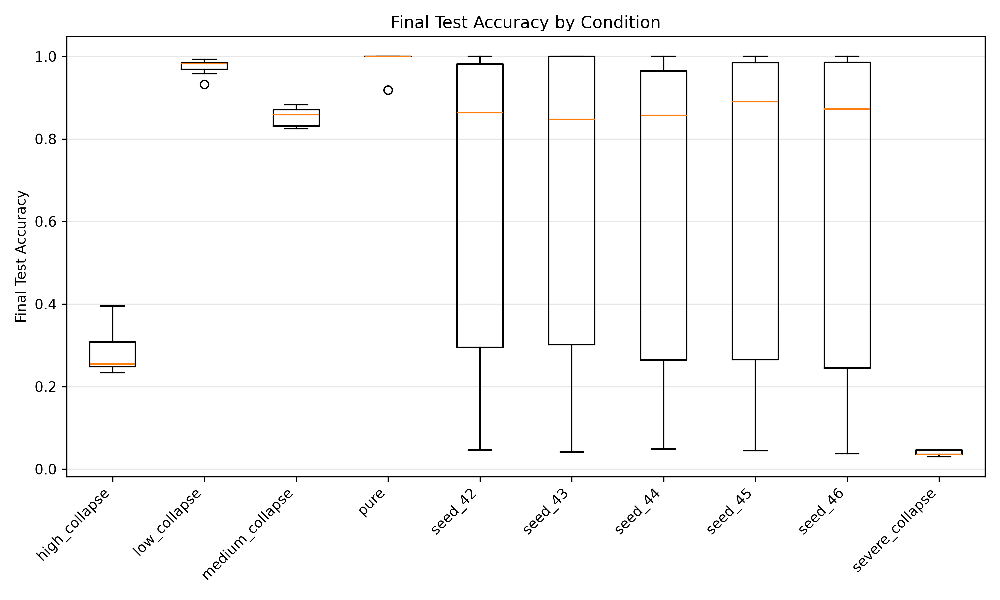
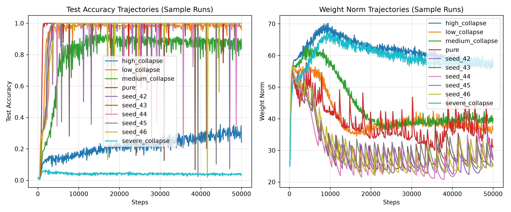

# Grokking & Model Collapse: Analysis Results

## Summary Statistics

| Condition       |   Grok_Rate |   N_Runs |   Mean_Grok_Step_All |   Std_Grok_Step |   Mean_Grok_Step_Success |   Mean_Final_Acc |   Std_Final_Acc |   Mean_WN_Change |   Std_WN_Change |
|:----------------|------------:|---------:|---------------------:|----------------:|-------------------------:|-----------------:|----------------:|-----------------:|----------------:|
| high_collapse   |       0     |        7 |               nan    |         nan     |                    -1    |           0.2851 |          0.0615 |          30.8965 |          4.0846 |
| low_collapse    |       1     |        7 |              2700    |         321.455 |                  2700    |           0.9734 |          0.0212 |          10.4556 |          1.0885 |
| medium_collapse |       0     |        7 |               nan    |         nan     |                    -1    |           0.853  |          0.0237 |          15.7261 |          3.8599 |
| pure            |       1     |        7 |              1457.14 |         171.825 |                  1457.14 |           0.9883 |          0.0309 |           6.8328 |          3.7065 |
| seed_42         |       0.475 |       40 |              4663.16 |        5425.58  |                  4663.16 |           0.6803 |          0.3665 |          11.5664 |         12.7773 |
| seed_43         |       0.475 |       40 |              5310.53 |        7457.05  |                  5310.53 |           0.6875 |          0.3687 |          11.9995 |         12.177  |
| seed_44         |       0.475 |       40 |              4668.42 |        6586.78  |                  4668.42 |           0.672  |          0.3644 |          12.5922 |         12.1064 |
| seed_45         |       0.475 |       40 |              3584.21 |        3995.03  |                  3584.21 |           0.6828 |          0.3742 |          11.3619 |         12.9752 |
| seed_46         |       0.475 |       40 |              4942.11 |        6807.95  |                  4942.11 |           0.6826 |          0.3721 |          12.6402 |         14.033  |
| severe_collapse |       0     |        7 |               nan    |         nan     |                    -1    |           0.0395 |          0.0067 |          34.479  |          3.7041 |

## Statistical Significance

## Visualizations

### Accuracy Distribution

### Learning Trajectories

