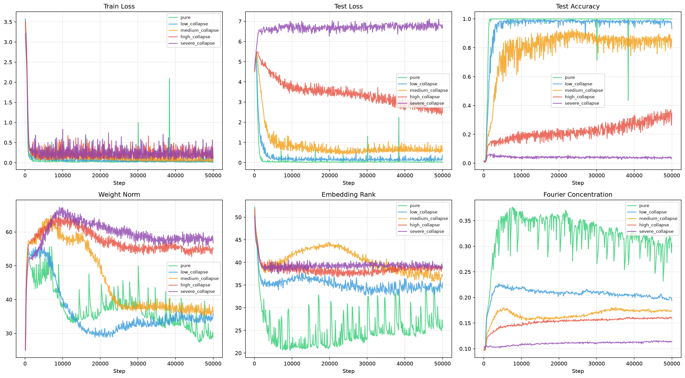
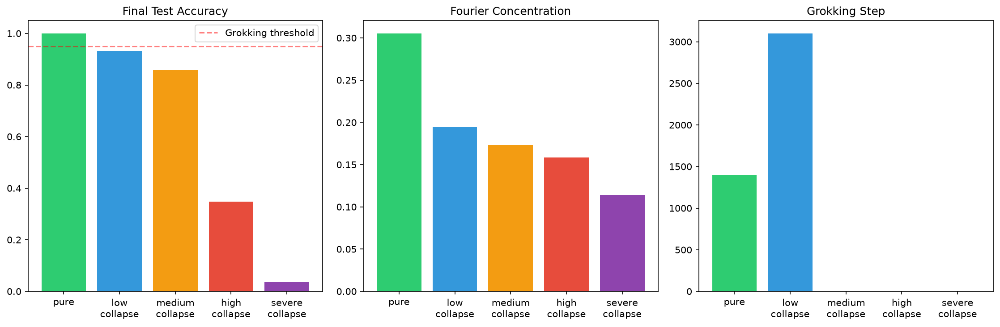

# Grokking and Model Collapse Results

This document summarizes the mechanistic and performance impacts of model collapse on the grokking phenomenon in modular arithmetic models.

## Training Trajectories

Model training trajectories were evaluated across a spectrum of collapse severities: `pure`, `low_collapse`, `medium_collapse`, `high_collapse`, and `severe_collapse`. The following plot displays the training trajectories for test loss, test accuracy, weight norm, embedding rank, and Fourier concentration across the different levels of collapse.

## Collapse Severity and Grokking

As training progresses, models on clean data (`pure`) exhibit standard grokking: an initial phase of overfitting followed by a sharp phase transition where test accuracy rises from near-chance to 100%, coinciding with a steep reduction in weight norm and embedding rank, and an increase in Fourier concentration.

The `low_collapse` condition also eventually groks, but the transition is significantly delayed (shifted rightward on the training step axis).

In contrast, `medium_collapse`, `high_collapse`, and `severe_collapse` conditions **fail to grok entirely**. They plateau at a suboptimal test accuracy and never undergo the cleanup phase transition characterized by weight-norm reduction and Fourier concentration.

## Summary of Findings

1.  **Delayed Grokking:** Low levels of collapse delay the onset of grokking, requiring significantly more training steps to reach the generalization phase transition compared to pure data.
2.  **Grokking Failure:** Beyond a critical threshold of collapse severity (medium, high, severe), the model fails to generalize. The test accuracy remains low, and the mechanistic signatures of grokking (weight norm reduction, feature sparsification) do not appear.
3.  **Weight Norm and Rank:** Grokking is robustly associated with a reduction in the total weight norm and the effective rank of the embedding matrix. Collapsed models fail to undergo this weight-norm reduction.
4.  **Fourier Structure:** Successful grokking correlates with a high Fourier concentration in the embedding weights. Models trained on collapsed data that fail to grok also fail to develop this structured Fourier representation.